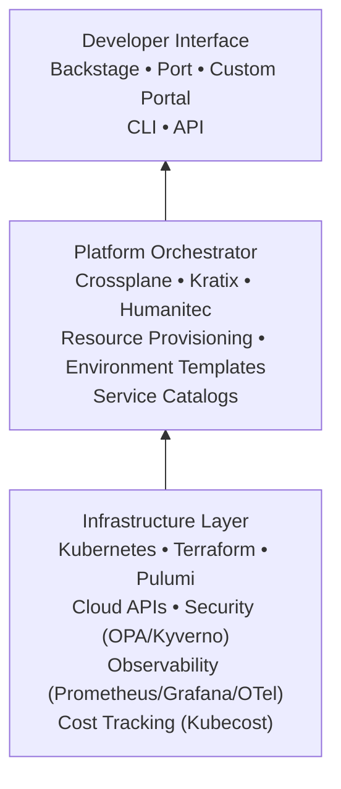

# Platform Engineering 2026 → Research Document

> **Purpose**: Deep reference for Platform Engineering paradigm → Internal Developer Platforms (IDPs), Backstage, Crossplane, and the shift from traditional DevOps.

**Last updated**: 2026-05-26
---

## 1. Definition and 2026 Context

**Platform Engineering** is the practice of building Internal Developer Platforms (IDPs) that abstract infrastructure complexity, enabling developers to self-serve infrastructure while maintaining governance and security guardrails.

In 2026, platform engineering is the **most significant trend** in the cloud-native ecosystem:
- 19.9M cloud-native developers globally
- 88% work with standardized infrastructure
- 12% without formalized platform practices (down from 20%)
- Platform engineering is the primary growth driver of cloud-native adoption

---

## 2. Platform Engineering vs Traditional DevOps

| Aspect | Traditional DevOps | Platform Engineering |
|---|---|---|
| Focus | Toolchain and automation | Developer experience and abstraction |
| Target | Ops teams | Application developers |
| Interface | Scripts, YAML, CLIs | Self-service portals, APIs |
| Governance | Manual reviews | Policy-as-code, guardrails |
| Scale | Per-team or per-project | Organization-wide |
| Key Metric | Deployment frequency | Developer happiness, time-to-inner-loop |

---

## 3. IDP Architecture (2026 Reference)

---

## 4. Platform Engineering Tools

| Tool | Type | Stars | CNCF Status | Best For |
|---|---|---|---|---|
| **Backstage** | Developer portal | 30k+ | Graduated | The #1 choice for developer portals |
| **Crossplane** | Control plane framework | 10k+ | Graduated | K8s-native cloud resource management |
| **Kratix** | Platform orchestration | 1k+ | Sandbox | Building composable IDPs |
| **Port** | Developer portal | - | → | SaaS alternative to Backstage |
| **Humanitec** | Platform orchestrator | - | → | Commercial IDP platform |

---

## 5. Freelance Platform Engineering Opportunities

| Service | Rate Range | Demand |
|---|---|---|
| Backstage developer portal setup | $120–200/hr | 🔥 Very High |
| Crossplane control plane implementation | $130–220/hr | 🔥 High |
| IDP architecture & consulting | $150–250/hr | 🔥🔥 Highest |
| Developer platform migration | $120–200/hr | 🔥 High |
| Platform engineering training/mentoring | $150–250/hr | 🔥 High |

---

## 6. References
- CNCF. "Technology Radar Q1 2026."
- Signisys. "CNCF Reports Nearly 20 Million Cloud-Native Developers." April 2026.
- CNCF. Backstage, Crossplane, Kratix project documentation.
- SDH Global. "Platform Engineering Will Replace Traditional DevOps Models." 2026.
