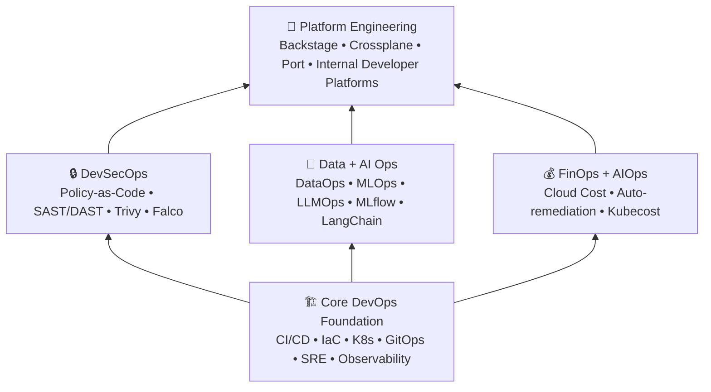

# Paradigm Familiarization → Ops Landscape Overview

> **Purpose**: Foundational orientation across all Ops paradigms → what they are, how they connect, and where to learn more. Use this as your entry point before diving into individual research docs.

**Last updated**: 2026-05-26

---

## 📋 How to Use This Document

This is a **synthesis / reading list** → not a deep reference. Each paradigm section gives you:
1. A concise definition
2. Core concepts you need to understand
3. Recommended learning resources
4. Cross-reference to the relevant research doc in this project

If you're new to a paradigm: read the section here, then open the linked research doc.  
If you're familiar: skip straight to the research doc.

---

## 1. DevOps

| Attribute | Detail |
|---|---|
| **Born** | ~2009 |
| **2026 Maturity** | ✅ Mature / Baseline |
| **Core Artifact** | Application code |
| **Primary Goal** | Faster, reliable software releases |

### What It Is

DevOps bridges development and operations through culture, automation, and measurement. In 2026 it's the **baseline** → not a differentiator, but a prerequisite. The Perforce State of DevOps 2026 report finds 70% of organizations say DevOps maturity meaningfully influences AI success.

### Core Concepts

- **CI/CD** → Continuous Integration (merge + test often) + Continuous Delivery (deploy automatically)
- **Infrastructure as Code (IaC)** → Manage infrastructure through version-controlled config files
- **Monitoring & Observability** → Know what's happening in production
- **Collaboration culture** → Shared ownership across Dev and Ops

### Learning Path (Newcomer)

1. [The Phoenix Project](https://www.goodreads.com/book/show/17255186-the-phoenix-project) → Novel that explains DevOps principles
2. [The DevOps Handbook](https://www.goodreads.com/book/show/26083308-the-devops-handbook) → Practical guide
3. [State of DevOps Report (Perforce 2026)](https://www.perforce.com/resources/state-of-devops) → Current industry data
4. **Hands-on**: Set up a GitHub Actions CI/CD pipeline for a toy app

### Project Docs

- [DevOps Landscape 2026](./devops-landscape-2026.md) → Full research
- [CI/CD & GitOps Tools](../tools/ci-cd-tools.md) → Tool comparisons
- [IaC Tools](../tools/iaac-tools.md) → Infrastructure as Code

---

## 2. DevSecOps

| Attribute | Detail |
|---|---|
| **Born** | ~2012 |
| **2026 Maturity** | ✅ Enterprise standard |
| **Core Artifact** | Code + Security policies |
| **Primary Goal** | Shift-smart security integrated in pipeline |

### What It Is

DevSecOps integrates security into every phase of the DevOps lifecycle → not as a gate at the end, but as continuous checks throughout. The 2026 trend is "shift-smart" (not "shift-left"): automate what you can, review what needs human judgment.

### Core Concepts

- **SAST** (Static Application Security Testing) → Analyze source code for vulnerabilities
- **DAST** (Dynamic Application Security Testing) → Test running applications
- **SCA** (Software Composition Analysis) → Scan dependencies for known CVEs
- **Policy-as-Code** → Enforce security rules automatically (OPA, Kyverno)
- **Supply Chain Security** → SLSA framework, SBOMs, signing

### Learning Path

1. [OWASP Top 10](https://owasp.org/www-project-top-ten/) → Web app vulnerability categories
2. [Application Security Verification Standard (ASVS)](https://owasp.org/www-project-application-security-verification-standard/)
3. **Hands-on**: Add Trivy + Semgrep to a CI pipeline
4. [SLSA Framework](https://slsa.dev/) → Supply chain levels

### Project Docs

- [DevSecOps Landscape 2026](./devsecops-landscape-2026.md) → Full research
- [DevSecOps & Security Tools](../tools/security-devsecops.md) → Tool comparisons

---

## 3. DataOps

| Attribute | Detail |
|---|---|
| **Born** | ~2014 |
| **2026 Maturity** | 🔄 Growing |
| **Core Artifact** | Data pipelines & datasets |
| **Primary Goal** | Faster, trustworthy data delivery |

### What It Is

DataOps applies DevOps principles (CI/CD, versioning, monitoring) to data pipelines. It treats data as a product with quality gates, observability, and automated testing. Growing alongside AI/ML adoption → bad data = bad models.

### Core Concepts

- **Data pipelines** → Automated ETL/ELT workflows
- **Data versioning** → Git-like version control for datasets (DVC, LakeFS)
- **Data quality** → Schema validation, freshness checks, anomaly detection
- **Data catalogs** → Metadata management and discovery

### Learning Path

1. [DataOps: A Beginners Guide](https://dataops.live/beginners-guide/) → Free introductory guide
2. [Data Mesh by Zhamak Dehghani](https://www.oreilly.com/library/view/data-mesh/9781492092384/) → Organizational pattern
3. **Hands-on**: Build a simple data pipeline with dbt + Great Expectations

### Project Docs

- [DataOps Landscape 2026](./dataops-landscape-2026.md) → Full research

---

## 4. MLOps

| Attribute | Detail |
|---|---|
| **Born** | ~2015 |
| **2026 Maturity** | 🔄 High growth |
| **Core Artifact** | Code + Data + Model |
| **Primary Goal** | Reliable model deployment & retraining |

### What It Is

MLOps manages the full ML lifecycle: experiment tracking, model training, deployment, monitoring, and retraining. In 2026 it commands the **highest salary premium** → senior MLOps engineers average **$205K base**.

### Core Concepts

- **Experiment tracking** → Log parameters, metrics, artifacts (MLflow, W&B)
- **Model registry** → Versioned model storage with stage promotion
- **Model serving** → Deploy models as APIs (KServe, Seldon)
- **Drift monitoring** → Detect data/concept drift in production
- **Feature store** → Centralized feature engineering and serving (Feast)

### Learning Path

1. [Designing Machine Learning Systems by Chip Huyen](https://www.oreilly.com/library/view/designing-machine-learning/9781098107956/) → Best overall MLOps book
2. [MLOps Course by Made With ML](https://madewithml.com/) → Free, practical
3. **Hands-on**: Deploy a model with MLflow → KServe → Evidently AI monitoring
4. [Kubeflow docs](https://www.kubeflow.org/docs/) → End-to-end MLOps on K8s

### Project Docs

- [MLOps Landscape 2026](./mlops-landscape-2026.md) → Full research
- [MLOps & LLMOps Tools](../tools/mlops-llmops-tools.md) → Tool comparisons

---

## 5. AIOps

| Attribute | Detail |
|---|---|
| **Born** | ~2016 |
| **2026 Maturity** | 🔄 Rapid adoption |
| **Core Artifact** | Operational telemetry |
| **Primary Goal** | AI-driven IT operations automation |

### What It Is

AIOps applies machine learning to IT operations data (logs, metrics, traces) to automate incident detection, root cause analysis, and remediation. In 2026, AIOps is converging with AI-assisted SRE tools like HolmesGPT and K8sGPT.

### Core Concepts

- **Anomaly detection** → ML models that learn normal behavior patterns
- **Incident correlation** → Group related alerts into single incidents
- **Root cause analysis** → Automated RCA from telemetry data
- **Self-healing** → Automated remediation actions
- **Event correlation** → Reduce alert noise

### Learning Path

1. [Gartner AIOps Market Guide](https://www.gartner.com/en/documents/3981793) → Market overview
2. [Practical AIOps by PagerDuty](https://www.pagerduty.com/resources/guides/aiops/) → Free guide
3. **Hands-on**: Set up Prometheus + Alertmanager → test with HolmesGPT

### Project Docs

- [AIOps Landscape 2026](./aiops-landscape-2026.md) → Full research

---

## 6. FinOps

| Attribute | Detail |
|---|---|
| **Born** | ~2017 |
| **2026 Maturity** | ✅ Enterprise practice |
| **Core Artifact** | Cloud cost & usage data |
| **Primary Goal** | Financial accountability in cloud |

### What It Is

FinOps brings financial governance to cloud spending → combining engineering, finance, and business teams to make cost-data-driven decisions. In 2026, it's integrated into platform engineering with automated chargeback and showback.

### Core Concepts

- **Cost allocation** → Tagging resources to teams/projects
- **Reserved/committed capacity** → Pre-purchase for discounts
- **Right-sizing** → Match instance types to actual usage
- **Spot/preemptible instances** → Use spare capacity for non-critical workloads
- **Anomaly detection** → Alert on unexpected cost spikes

### Learning Path

1. [FinOps Certified Practitioner](https://learn.finops.org/) → Free certification prep
2. [Cloud FinOps by J.R. Storment](https://www.oreilly.com/library/view/cloud-finops/9781492098348/) → Comprehensive guide
3. **Hands-on**: Set up Kubecost on a K8s cluster → generate cost reports

### Project Docs

- [FinOps Landscape 2026](./finops-landscape-2026.md) → Full research
- [Cost Management & FinOps Tools](../tools/cost-management-finops.md) → Tool comparisons

---

## 7. LLMOps

| Attribute | Detail |
|---|---|
| **Born** | ~2022 |
| **2026 Maturity** | 🆕 Emerging |
| **Core Artifact** | LLMs + Prompts + RAG |
| **Primary Goal** | Safe, governed generative AI operations |

### What It Is

LLMOps operationalizes Large Language Models in production → covering prompt engineering, RAG (Retrieval-Augmented Generation), guardrails, cost management, and monitoring for hallucinations. The fastest-evolving Ops paradigm in 2026.

### Core Concepts

- **RAG** → Augment LLM responses with retrieved context from a knowledge base
- **Prompt management** → Version, test, and deploy prompts systematically
- **Guardrails** → Input/output validation, content safety filters
- **LLM observability** → Trace calls, measure latency, detect hallucinations
- **Cost per query** → Token usage tracking and optimization

### Learning Path

1. [LangChain Academy](https://academy.langchain.com/) → Free RAG/agent courses
2. [Building LLM Apps by Valentina Alto](https://www.oreilly.com/library/view/building-llm-apps/9781098154752/) → Production patterns
3. **Hands-on**: Build a RAG pipeline with LangChain → deploy with Guardrails

### Project Docs

- [LLMOps Landscape 2026](./llmops-landscape-2026.md) → Full research
- [MLOps & LLMOps Tools](../tools/mlops-llmops-tools.md) → Tool comparisons

---

## 8. Platform Engineering

| Attribute | Detail |
|---|---|
| **Born** | ~2020 |
| **2026 Maturity** | ✅ Mainstream |
| **Core Artifact** | Developer platforms |
| **Primary Goal** | Internal developer platforms (IDPs) |

### What It Is

Platform Engineering builds Internal Developer Platforms (IDPs) → a layer of tooling and services that abstract infrastructure complexity so developers can ship faster. It's the **fastest-growing job category** in the Ops space for 2026.

### Core Concepts

- **Developer portals** → Self-service UI for infrastructure (Backstage, Port)
- **Golden paths** → Pre-approved, standardized deployment patterns
- **Control planes** → Kubernetes-native resource provisioning (Crossplane)
- **Service catalogs** → Discoverable, documented internal services
- **Scorecards** → Track team maturity and standards compliance

### Learning Path

1. [Team Topologies by Matthew Skelton](https://www.oreilly.com/library/view/team-topologies/9781098154981/) → Org patterns for platform teams
2. [Platform Engineering on Kubernetes by Mauricio Salatino](https://www.oreilly.com/library/view/platform-engineering-on/9781098158712/) → Practical implementation
3. **Hands-on**: Set up Backstage with a basic plugin → add service catalog
4. [CNCF Platform Engineering Maturity Model](https://www.cncf.io/reports/platform-engineering-maturity-model/)

### Project Docs

- [Platform Engineering 2026](./platform-engineering-2026.md) → Full research
- [Platform Engineering Tools](../tools/platform-engineering.md) → Tool comparisons

---

## 9. GitOps

| Attribute | Detail |
|---|---|
| **Born** | ~2017 |
| **2026 Maturity** | ✅ Production proven |
| **Core Artifact** | Git repositories |
| **Primary Goal** | Git as single source of truth for infra |

### What It Is

GitOps uses Git as the single source of truth for declarative infrastructure and applications. A GitOps operator (ArgoCD, Flux) continuously syncs the cluster state with the Git repository. It's a maturity differentiator → 58% of "cloud-native innovators" use it extensively.

### Core Concepts

- **Declarative config** → Desired state defined in Git, not imperative commands
- **Automated sync** → Operator reconciles actual → desired state
- **Pull-based deployment** → Cluster pulls from Git, not CI pushing to cluster
- **Drift detection** → Operator detects and corrects manual changes

### Learning Path

1. [GitOps Principles (CNCF)](https://opengitops.dev/) → Official definition and principles
2. [ArgoCD docs](https://argo-cd.readthedocs.io/) → Practical hands-on learning
3. **Hands-on**: Deploy an app to K8s using ArgoCD with Git as source of truth

### Project Docs

- [GitOps Tools](../tools/gitops-tools.md) → Tool comparisons
- [DevOps Landscape 2026](./devops-landscape-2026.md) → GitOps section

---

## 10. SRE

| Attribute | Detail |
|---|---|
| **Born** | ~2003 |
| **2026 Maturity** | ✅ Mature discipline |
| **Core Artifact** | Reliability metrics |
| **Primary Goal** | Service reliability through SLIs/SLOs |

### What It Is

Site Reliability Engineering applies software engineering to operations problems. Born at Google, SRE uses service level indicators (SLIs), objectives (SLOs), and error budgets to balance reliability with feature velocity.

### Core Concepts

- **SLI** → A quantifiable measure of service performance (latency, error rate)
- **SLO** → Target threshold for an SLI (e.g., 99.9% availability)
- **Error budget** → The acceptable amount of unreliability (100% - SLO)
- **Toil reduction** → Automate repetitive operational work
- **Incident management** → Structured response with blameless postmortems

### Learning Path

1. [Site Reliability Engineering (Google SRE Book)](https://sre.google/books/) → Free online
2. [The Site Reliability Workbook](https://sre.google/workbook/) → Practical patterns
3. **Hands-on**: Define SLIs/SLOs for a service → set up burn-rate alerts

### Project Docs

- Referenced across multiple research docs (AIOps, Observability)

---

## 🧭 The Ops Landscape → How They Relate



**2026 convergence trends:**

| Trend | What's Happening |
|---|---|
| DevOps → Platform Engineering | Core DevOps skills are now wrapped into IDP self-service layers |
| DevSecOps → Policy-as-Code | Security rules automated via OPA/Kyverno, not manual reviews |
| MLOps + LLMOps → AI Ops | Unified platforms managing both predictive and generative AI |
| AIOps → Autonomous Ops | SRE tools augmented with AI for self-healing |
| FinOps → Embedded cost | Cost management built into platform engineering |

---

## 📚 Recommended Reading Order

If you're new to the Ops landscape, learn in this order:

```
1. DevOps              ← Foundation (everything builds on this)
2. GitOps              ← How infra is managed in practice
3. DevSecOps           ← Security is non-negotiable
4. Platform Engineering ← Where DevOps teams are heading
5. SRE                ← Reliability mindset
6. Observability       ← How you know it's working
7. FinOps              ← Cost governance
8. DataOps             ← Data pipeline operations
9. MLOps               ← ML lifecycle management
10. LLMOps             ← Generative AI (if relevant to your clients)
11. AIOps              ← AI for IT operations
```

---

## 📖 Essential Reading (Outside This Project)

### Books

| Title | Author | Covers |
|---|---|---|
| [The DevOps Handbook](https://www.goodreads.com/book/show/26083308-the-devops-handbook) | Gene Kim et al. | Core DevOps principles |
| [Accelerate](https://www.goodreads.com/book/show/35747076-accelerate) | Nicole Forsgren et al. | Metrics-driven DevOps |
| [Team Topologies](https://www.oreilly.com/library/view/team-topologies/9781098154981/) | Matthew Skelton | Org patterns for platform teams |
| [Designing Machine Learning Systems](https://www.oreilly.com/library/view/designing-machine-learning/9781098107956/) | Chip Huyen | MLOps end-to-end |
| [Cloud FinOps](https://www.oreilly.com/library/view/cloud-finops/9781492098348/) | J.R. Storment | Cloud cost management |
| [Site Reliability Engineering](https://sre.google/books/) | Google | SRE foundations |

### Industry Reports (2026)

| Report | Publisher | Why Read |
|---|---|---|
| [State of DevOps 2026](https://www.perforce.com/resources/state-of-devops) | Perforce | Broadest DevOps maturity survey |
| [CNCF Annual Survey 2025](https://www.cncf.io/reports/) | CNCF | Cloud-native adoption trends |
| [CNCF Technology Radar Q1 2026](https://radar.cncf.io/) | CNCF | Emerging tech assessment |
| [Gartner Top Strategic Tech Trends 2026](https://www.gartner.com/en) | Gartner | Enterprise direction |

### Academic Sources

- [arXiv:2401.XXXXX] → Systematic literature reviews on each paradigm
- [ACM Computing Surveys] → Comprehensive survey papers
- Full list in [Academic References](./academic-references.md)

---

## 🛠 Project Reference Map

| Paradigm | Research Doc | Extended List | Guide |
|---|---|---|---|
| DevOps | ✅ [Landscape](./devops-landscape-2026.md) | ✅ [CI/CD](../tools/ci-cd-tools.md), [IaC](../tools/iaac-tools.md), [Container](../tools/container-orchestration.md), [Observability](../tools/observability-monitoring.md), [Messaging](../tools/messaging-streaming.md) | ✅ [Roadmap](../get-started/freelance-devops-roadmap.md) |
| GitOps | ✅ (in DevOps doc) | □ Pending | - |
| DevSecOps | ✅ [Landscape](./devsecops-landscape-2026.md) | ✅ [Security Tools](../tools/security-devsecops.md) | - |
| DataOps | ✅ [Landscape](./dataops-landscape-2026.md) | - | → |
| MLOps | ✅ [Landscape](./mlops-landscape-2026.md) | □ Pending | - |
| AIOps | ✅ [Landscape](./aiops-landscape-2026.md) | ✅ [AI for DevOps](../tools/ai-for-devops.md) | - |
| FinOps | ✅ [Landscape](./finops-landscape-2026.md) | □ Pending | - |
| LLMOps | ✅ [Landscape](./llmops-landscape-2026.md) | □ Pending | - |
| Platform Eng | ✅ [Landscape](./platform-engineering-2026.md) | □ Pending | - |
| SRE | ✅ (across docs) | - | → |

---

## ✅ What's Next After This Document

Once you've oriented yourself across all paradigms, proceed to:

1. **Phase 1 (Core Research)** → Read the research docs for paradigms most relevant to your clients
2. **Phase 2 (Extended Lists)** → Use tool comparison lists for vendor/client evaluations
3. **Phase 3 (README)** → The curated list for quick reference
4. **Phase 4 (Guides)** → Learning roadmaps and contribution guides

---

*This document was created as part of Phase 0 → Foundation. It synthesizes knowledge across all Ops paradigms to build foundational understanding before deep research.*
